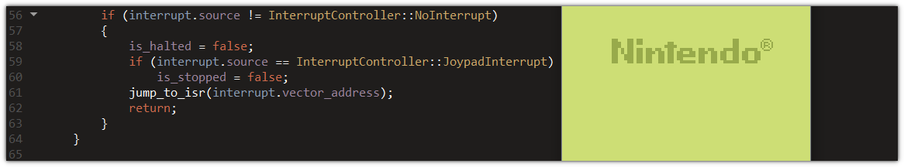

# Portfolio - Anton Ihonen

Updated 24 February, 2020

## About this repository
The purpose of this repository is simply to serve as a compact collection of
the most notable projects I have undertaken. This is by no means everything I
have ever done.

## About me
I am a computer engineering student at Tampere University. While I am very
interested in computer hardware, the thing I am most passionate about is
systems programming where I get to interact with the hardware in software.
However, I just love C/C++ in general - I can barely survive a week without
writing any code - and am interested in pretty much any job or project
involving either.

## Finished Projects

### [Arduino Uno DIY replica](https://github.com/ihonen/ELT-21300)

A uni project I did in 2018. Easily one of the greatest learning
experiences I have ever had. The end product is a fully functional
copy of Arduino Uno that is also compatible with extension shields
for the Uno. 

**Tools and technologies involved:**
- Atmel Studio
- AVR microcontroller architecture
- C
- KiCad

### [Darksweeper](https://github.com/ihonen/darksweeper)

A fun little project I started on a boring weekend to learn Qt while having fun
(both of which I did). Nothing is better than Minesweeper, except for
Minesweeper with a dark user interface, right?

**Tools and technologies involved:**
- C++
- Qt

## Ongoing Projects

### [Game Boy emulator](https://github.com/ihonen/gbemu)

A project combining my primary interests: low-level software and
computer hardware. Still badly work-in-progress. Most of the
emulation has been implemented, though, and the next step will be
getting rid of the bugs that currently prevent the emulator from
functioning correctly.

**Tools and technologies involved:**
- C++
- Emulation
- Qt

## Suspended Projects

### [Logging library in C99](https://github.com/ihonen/Clogger)

I never finished this project because halfway through I realized there
are better alternatives and it would be a waste of time to continue.
I think it is worth mentioning nonetheless. The logger is extremely
fast, by the way (~1,000,000 formatted log entries per second on my
somewhat mediocre laptop).

**Tools and technologies involved:**
- C
- Doxygen
- Microsoft Visual Studio
