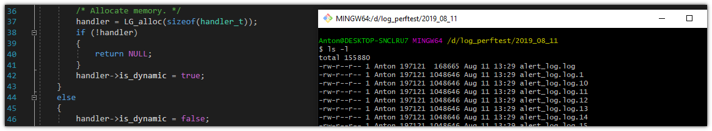

# Portfolio - Anton Ihonen
Updated 27 August, 2019

## About this repository
The purpose of this repository is simply to serve as a compact collection of
the most notable projects I have undertaken - and _finished_; I'll admit
that I have far too many projects that were never taken to their
conclusion.

## About me
I am a BSc student at Tampere University of Technology. Having started in the
electrical engineering program, I have a basic understanding of traditional
electronics and electronics design. However, my true passion lies in the field
of computer systems engineering. I am interested in both hardware and
low-level software - kernels, drivers, protocols, algorithms, you name it -
and that fascination will hopefully be reflected in my portfolio as well.

## Projects

### [Arduino Uno DIY replica](https://github.com/ihonen/ELT-21300)

A project I did at uni in the spring of 2018. One of the greatest
learning experiences I have ever had!

**Techniques involved:**
- Electronics design (schematics, layout)
- PCB manufacturing (etching, soldering)
- Bare-metal programming

**Technologies used:**
- Atmel Studio
- AVR microcontroller architecture
- C programming language (C99)
- KiCad

### [Logging library in C99](https://github.com/ihonen/Clogger)

I'll include this project even if it's badly work-in-progress and I don't
plan to keep working on it (because I realized halfway through that there
are better alternatives for people to pick from). I think it is worth
showcasing nonetheless because, while incomplete and poorly documented, it
shows my programming style and skill level to a person who knows what to
look out for.

**Techniques involved:**
- Systems programming
- Testing (functional, unit)
- Debugging
- Documentation (note: most of it now deleted due to being outdated)
- Software design

**Technologies used:**
- C programming language (C99)
- Doxygen
- File systems
- Microsoft Visual Studio
